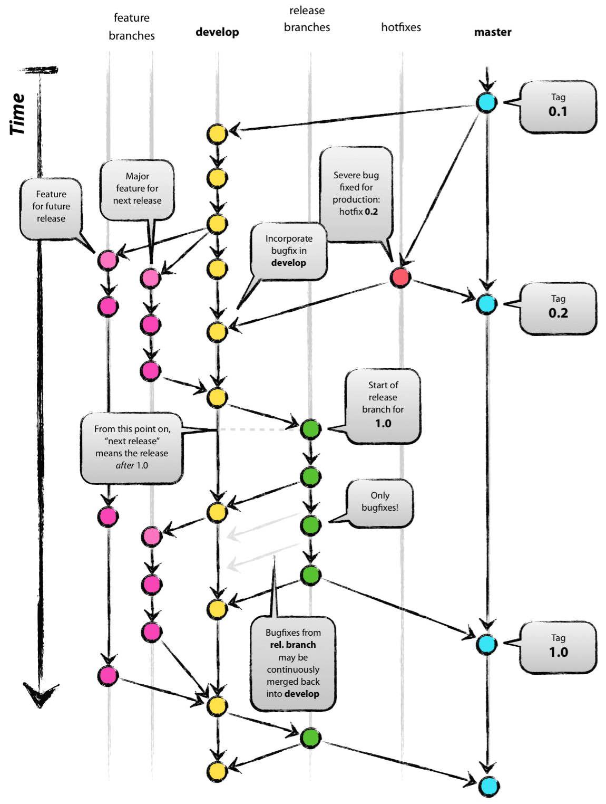

# 经典GitFlow

## GitFlow说明

* main分支，即主分支。任何项目都必须有个这个分支。对项目进行tag或发布版本等操作，都必须在该分支上进行。

* develop分支，即开发分支，从main分支上检出。团队成员一般不会直接更改该分支，而是分别从该分支检出自己的feature分支，开发完成后将feature分支上的改动merge回develop分支。同时release分支由此分支检出。

* release分支，即发布分支，从develop分支上检出。该分支用作发版前的测试，可进行简单的bug修复。如果bug修复比较复杂，可merge回develop分支后由其他分支进行bug修复。此分支测试完成后，需要同时merge到main和develop分支上。

* feature分支，即功能分支，从develop分支上检出。团队成员中每个人都维护一个自己的feature分支，并进行开发工作，开发完成后将此分支merge回develop分支。此分支一般用来开发新功能或进行项目维护等。

* fix分支，即补丁分支，由develop分支检出，用作bug修复，bug修复完成需merge回develop分支，并将其删除。所以该分支属于临时性分支。

* hotfix分支，即热补丁分支。和fix分支的区别在于，该分支由main分支检出，进行线上版本的bug修复，修复完成后merge回main分支，并merge到develop分支上，merge完成后也可以将其删除，也属于临时性分支。

## commit message说明

* feat：新功能（feature）

* fix：修补bug

* docs：文档（documentation）

* style： 格式（不影响代码运行的变动）

* refactor：重构（即不是新增功能，也不是修改bug的代码变动）

* test：增加测试

* chore：构建过程或辅助工具的变动