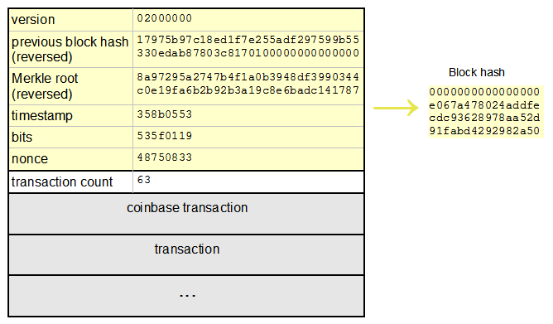

# POW

```text
所谓“共识机制”，是通过特殊节点的投票，在很短的时间内完成对交易的验证和确认；对一笔交易， 如果利益不相干的若干个节点能够达成共识，我们就可以认为全网对此也能够达成共识。
```

`PoW`，全称`Proof of Work`，即工作量证明。比特币、以太坊等公有链均基于PoW算法来实现共识机制。

## 比特币PoW

寻找到一个`nonce`值，以`区块头` + `nonce`作为SHA256的输入，使其计算出的结果小于目标值的计算过程。

### 区块

如下图所示，区块分为区块头和区块体。



#### 区块头

区块头的大小为 80 字节，由 4 字节的版本号、32 字节的上一个区块的散列值`block hash`、32 字节的`Merkle Root Hash`、4字节的时间缀（当前时间）、4字节目标值`bits`、4字节的随机数`nonce`组成。

- **版本(Version)**：区块版本号，表示本区块遵守的验证规则 。
- **父区块头哈希值**：前一区块的哈希值，使用SHA256(SHA256(父区块头))计算。
- **Merkle根(MerkleRoot)**：该区块中交易的Merkle树根的哈希值。矿工收到计算过的区块，会跟自己的区块进行比较，其中Merkle root就是比较它们包含的交易是否一样。
- **时间戳(Timestamp)**：该区块产生的近似时间，精确到秒的UNIX时间戳，必须严格大于前11个区块时间的中值，同时全节点也会拒绝那些超出自己2个小时时间戳的区块。
- **目标值(Bits)**：该区块工作量证明算法的难度目标，已经使用特定算法编码。
  - 以比特币516532块为例：
    

    ```text
    A：Bits = "0x17502ab7"
    B：exponent指数，exponent = 0x17
    C：coefficient系数，coefficient = 0x502ab7
    D：target = coefficient * Math.Pow(2, 8 * (exponent - 3))
    E：目标hash：000000000000000000502ab700000000d6420b16625d309c4561290000000000
    F：实际hash：00000000000000000041ff1cfc5f15f929c1a45d262f88e4db83680d90658c0c
    ```

- **随机数（Nonce）**：为了找到满足难度目标所设定的随机数。

#### 区块体

区块体保存交易列表的具体信息，其中的第一笔交易是`coinbase`交易，交易由两部分组成，打包区块的奖励以及用户执行交易支付的手续费。

### go语言简单实现PoW共识

```go
import (
    "math/big"
    "bytes"
    "crypto/sha256"
    "fmt"
)

// 256位Hash里面前面至少要有16个零，最大值为0x0000FFFF...
const targetBit  = 16

/*
 * type Block struct {
 *     //1. 区块高度
 *     Height int64
 *     //2. 上一个区块HASH
 *     PrevBlockHash []byte
 *     //3. 交易数据
 *     Data []byte
 *     //4. 时间戳
 *     Timestamp int64
 *     //5. Hash
 *     Hash []byte
 *     // 6. Nonce
 *     Nonce int64
 * }
 */

// big.Int 大数据存储 2^24，少表示前面8个0，target前面至少还需8个0
type ProofOfWork struct {
    Block *Block // 当前要验证的区块
    // 0000 0001 0000 0000 0000 0000 0000 0000
    target *big.Int // 大数据存储 2^24
}

// 数据拼接，返回字节数组
func (pow *ProofOfWork) prepareData(nonce int) []byte {
    data := bytes.Join(
        [][]byte{
            pow.Block.PrevBlockHash,
            pow.Block.Data,
            IntToHex(pow.Block.Timestamp),
            IntToHex(int64(targetBit)),
            IntToHex(int64(nonce)),
            IntToHex(int64(pow.Block.Height)),
        },
        []byte{},
    )

    return data
}


func (proofOfWork *ProofOfWork) IsValid() bool {

    //1.proofOfWork.Block.Hash
    //2.proofOfWork.Target


    var hashInt big.Int
    // []byte 转 Int
    hashInt.SetBytes(proofOfWork.Block.Hash)


    // Cmp compares x and y and returns:
    //
    //   -1 if x <  y
    //    0 if x == y
    //   +1 if x >  y
    if proofOfWork.target.Cmp(&hashInt) == 1 {
        return true
    }

    return false
}


func (proofOfWork *ProofOfWork) Run() ([]byte,int64) {


    //1. 将Block的属性拼接成字节数组

    //2. 生成hash

    //3. 判断hash有效性，如果满足条件，跳出循环

    nonce := 0

    var hashInt big.Int // 存储我们新生成的hash
    var hash [32]byte

    for {
        //准备数据
        dataBytes := proofOfWork.prepareData(nonce)

        // 生成hash
        hash = sha256.Sum256(dataBytes)
        fmt.Printf("\r%x",hash)


        // 将hash存储到hashInt
        hashInt.SetBytes(hash[:])

        //判断hashInt是否小于Block里面的target
        // Cmp compares x and y and returns:
        //
        //   -1 if x <  y
        //    0 if x == y
        //   +1 if x >  y
        if proofOfWork.target.Cmp(&hashInt) == 1 {
            break
        }

        nonce = nonce + 1
    }

    return hash[:],int64(nonce)
}


// 创建新的工作量证明对象
func NewProofOfWork(block *Block) *ProofOfWork  {

    //1.big.Int对象 1
    // 2
    //0000 0001
    // 8 - 2 = 6
    // 0100 0000  64
    // 0010 0000
    // 0000 0000 0000 0001 0000 0000 0000 0000 0000 0000 .... 0000

    //1. 创建一个初始值为1的target

    // int Int
    target := big.NewInt(1) // 1

    //2. 左移256 - targetBit

    target = target.Lsh(target,256 - targetBit)

    return &ProofOfWork{block,target}
}
```