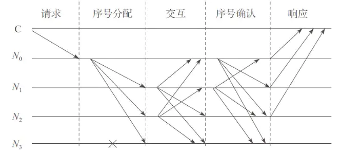

# PBFT

> 首先，我们来说结论：PBFT在保证可用性和安全性（liveness & safety）的前提下，提供了(n-1)/3的容错性，意思就是如果系统内有n台机子，那么系统最多能容忍的作恶/故障节点为(n-1)/3个。（作恶节点可以不响应或者回应错误的信息）。

## 理论原理

> The resiliency of our algorithm is optimal: 3f + 1 is the minimum number of replicas that allow an asynchronous system to provide the safety and liveness properties when up to f replicas are faulty (see [2] for a proof). This many replicas are needed because it must be possible to proceed after communicating with n - f replicas, since f replicas might be faulty and not responding. However, it is possible that the f replicas that did not respond are not faulty and, therefore, f of those that responded might be faulty. Even so, there must still be enough responses that those from non-faulty replicas outnumber those from faulty ones, i.e., n - 2f > f. Thereforen n > 3f.

**对于原文的理解：**
假设`拜占庭节点`数量为`f`（可能不乏任何消息，也可能发送错误消息），那么为了达成一致性，最理想的状态，所有`非拜占庭节点`都被选中，由这些节点达成一致，得出`n-f>f`，但实际没有理想状态，最差的情况是所有`拜占庭节点`都混入了`n-f`，所以必须有`n-f-f>f => n>3f`。 

## 算法原理

1. 一致性协议：  
   在PBFT系统中，节点分为两类：主节点（Lead）和从节点（Follow）。主节点就一个，其他剩余节点都是从节点。在实现PBFT系统功能之前，所有节点都是从节点，经过选举，产生一个主节点。每个节点都有被选举权和选举权，选举过程每个节点的概率都是平等的。  

   一致性协议包含若干个阶段：请求（Request）>序列分配（Pre-prepare）>相互交互（Prepare） >确认（Commit） >响应（Reply）。过程如下图：

   

   注：C为客户端或叫请求节点；0为当前视图下的主节点；1，2，3是从节点，其中3为宕机节点。
   该视图满足拜占庭容错，即系统节点总数4 >故障节点个数1x3

   1. Request阶段也就是Lead生成请求阶段。客户端发送请求到主节点，或者主节点主动从某数据源获取数据作为请求
   2. Pre-prepare阶段也就是Lead给其他所有Follow发送请求阶段。主节点将收到的请求进行处理，给请求赋值一个序列号n，形成一个带序号的副本，然后分发给其从节点。
   3. Prepare阶段也就是Follow收到请求，但不知道其他节点请求是什么，就给收到的请求签名发给其他所有节点，告诉他们我收到了这样一个请求。从节点接收到副本后，对副本进行校验和确认。检查副本中请求是否签名合法；检查d与m的摘要是否一致；检查当前视图编号是是否与副本v一致。满足这些条件后，从节点将副本存入消息日志中，然后对副本进行签名并转发给其他的所有节点（包括主节点）。如果不满足，则该验证节点就会进入View change阶段。
   4. Commit阶段也就是每个节点收到其他所有节点的签名请求，把这个合法请求跟自己之前保存的请求进行比较，如果超过有2f个请求一样，那么这个请求他会认为是大家共识的请求。然后对这个请求进行处理。当前阶段所有节点，包括主节点，对接收到的签名副本进行签名验证和确认。签名验证通过后的副本与自己保存的副本进行比较，设和自己一样的副本个数记为s，满足s+1>=2f，故障节点的个数为f，则该节点将会对这个请求进行响应，给予运算结果，并做签名。
   5. Reply阶段也就是将处理结果发送给客户端，客户端收到f+1个一样结果，那么客户端会认为该结果正确。每个收到请求的节点都会对请求进行响应处理，将结果广播给客户端。当客户端接收到f+1的响应相同时，则会认为该响应就是请求的结果。

2. 验证确认协议：
   在一致性协议使用时都用到了这个协议。在PBFT系统中，时刻保证数据的准确性，要进行数据校验和签名确认。对Lead的任何行为要进行监视，如果Lead有做越权或错误的事件，其他节点可以对其进行举报。

3. 视图更换协议：
   此阶段主要是用户在设计PBFT系统时，对Lead节点权限的设定。比如定时多长时间，正常更换Lead，其他Follow节点都有机会成为新的Lead。在Lead任期时期，如果超过2/3的节点反映它有问题，那么也会触发view change。还有Lead在运行中突然挂掉，也会触发view change。我们需要确保在新的view中如何来延续上一个view最终的状态，比如给这时来的新请求的编号，还有如何处理上一个view还没来得及完全处理好的请求。

## Go语言实现一个网络交互的PBFT工程

工程思路：

1. 开启4个终端，分别代表4个小国，开启http监听，监听路径有4个，分别是"/req"，"/prePrepare", "/prepare", "/commit"。
2. 任意一个节点通过http网页发起请求；
3. 该被请求节点会将数据写入自己的数组，然后并通过"/prePrepare"路径向其他节点广播该请求数据；
4. 其他节点通过节点监听接收到请求数据，将请求数据写入自己的数组，并通过"/Prepare"路径向其他节点广播该请求数据；
5. 所有节点将收到的数据进行校验，如果当前数组的长度大于所有节点个数的2/3，则输出OK，并将OK数据通过路径"/commit"广播给其他所有节点；
6. 当节点收到OK数量达到所有节点个数的1/3，则就是最后的结果。

```go
package main

import (
    "os"
    "fmt"
    "net/http"
    "io"
)

//声明nodeInfo节点，代表各个小国家
type nodeInfo struct {
    //节点名称
    id string
    //节点路径
    path string
    //http响应
    writer http.ResponseWriter
}

//创建map，存储各个国家的ip地址,也就是url
var nodeTable = make(map[string]string)

//当http服务器，接收到网络请求并且/req 则回调request
func (node *nodeInfo) request(writer http.ResponseWriter, request *http.Request) {
    //该命令允许request请求参数
    request.ParseForm()//解析完毕，打包返回。所以该方法不需要返回值。
    if (len(request.Form["warTime"]) > 0) {
        node.writer = writer
        fmt.Println("主节点接收到的参数信息为", request.Form["warTime"][0])
        //fmt.Println(request.Form["warTime"])打印出来是个数组，如果warTime=1111&2222等等，等号后边的是数组，warTime是map的key
        //激活主节点后，向其他的节点发送广播
        node.broadcast(request.Form["warTime"][0], "/prePrepare")
    }
}

//节点发送广播的方法
func (node *nodeInfo) broadcast(msg string, path string) {
    fmt.Println("广播", path)
    //遍历所有的节点
    for nodeId, url := range nodeTable {
        if nodeId == node.id {
            continue
        }
        //使当前节点以外的节点做响应
        http.Get("http://" + url + path + "?warTime=" + msg + "&nodeId=" + node.id)
    }
}

//处理广播后接收到的数据
func (node *nodeInfo) prePrepare(writer http.ResponseWriter, request *http.Request) {
    request.ParseForm()
    fmt.Println("接收到的广播为", request.Form["warTime"][0])
    if len(request.Form["warTime"]) > 0 {
        node.broadcast(request.Form["warTime"][0], "/prepare")
    }
}

//接收子节点的广播
func (node *nodeInfo) prepare(writer http.ResponseWriter, request *http.Request) {
    request.ParseForm()
    //打印消息
    fmt.Println("接收到的子节点的广播", request.Form["warTime"][0])
    //校验
    if len(request.Form["warTime"]) > 2/3*len(nodeTable) {
        node.authentication(request)
    }
}

var authenticationNodeMap = make(map[string]string)
var authenticationSuceess = false

//校验拜占庭
func (node *nodeInfo) authentication(request *http.Request) {
    if !authenticationSuceess {
        if len(request.Form["nodeId"]) > 0 {
            authenticationNodeMap[request.Form["nodeId"][0]] = "OK"
            //如果有两个国家节点正确的返回了结果
            if len(authenticationNodeMap) > len(nodeTable)/3 {
                authenticationSuceess = true
                node.broadcast(request.Form["warTime"][0], "/commit")
            }
        }
    }
}

//返回成功响应
func (node *nodeInfo) commit(writer http.ResponseWriter, request *http.Request) {
    if writer != nil {
        fmt.Println("拜占庭校验成功")
        //在网页上显示ok
        io.WriteString(node.writer, "ok")
    }
}

func main() {
    //接受终端参数
    userId := os.Args[1]
    fmt.Println(userId)
    //存储4个国家的IP地址
    nodeTable = map[string]string{
        "Apple":  "localhost:1111",
        "MS":     "localhost:1112",
        "Google": "localhost:1113",
        "IBM":    "localhost:1114",
    }

    //创建国家对象
    node := nodeInfo{id: userId, path: nodeTable[userId]}

    //http协议的回调函数
    http.HandleFunc("/req", node.request)
    http.HandleFunc("/prePrepare", node.prePrepare)
    http.HandleFunc("/prepare", node.prepare)
    http.HandleFunc("/commit", node.commit)
    //启动服务器
    if err := http.ListenAndServe(node.path, nil); err != nil {
        fmt.Println(err)
    }
}
```